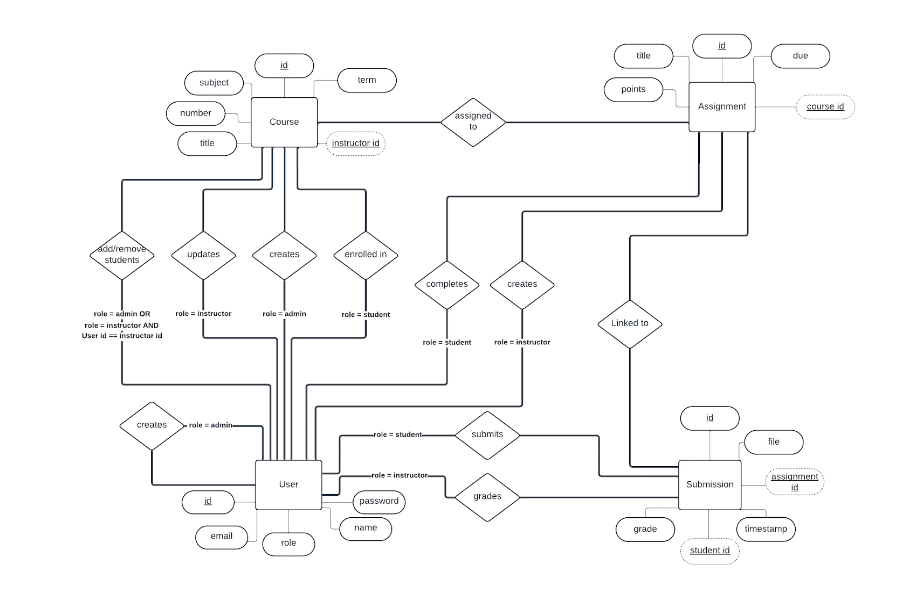
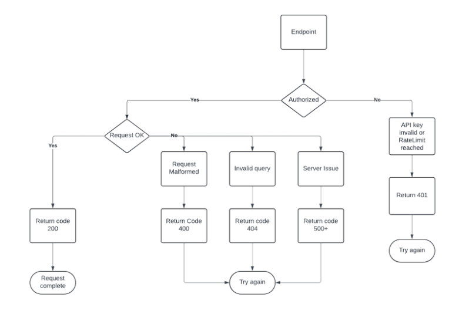

# tarpaulinAPI
## Contents
- [Project Overview](#project-overview)
- [API Connection](#api-connections)
- [Setup](#setup)
    

## Project Overview
This application is a lightweight course management tool. This application is compared to the Canvas page we use for OSU Cascades. Tarpaulin allows users (instructors and students) to see information about courses they are teaching/taking. This application will support endpoints based on the tarpualon_openapi_spec.
## API Connections
We have created different API diagrams for the data layout and the architecture.

API Data Layout

API Architecture

## Setup